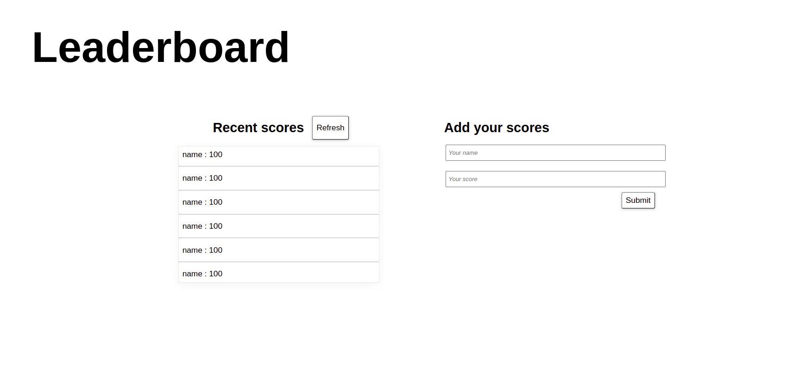

# Leaderboard
JavaScript project for the Leader-board list app, using webpack and ES6 features,

## Built With 
 - HTML
 - CSS
 - Javascript
 - webpack 
## Getting started
to run the project locally, clone the project using the command 

`https://github.com/banlon-jones/Leaderboard.git`
navigate in to the project directory, from GitHub,
- install project dependencies run the command
`npm install`
- Runs the app in the development mode. `npm start`
- Open http://localhost:8080 to view it in the browser.

## Authors

### Author1
 - Github: [banlon-jones](https://github.com/banlon-jones)
 - LinkedIn: [banlon jones](https://www.linkedin.com/in/banlon-jones-b0205812a)
 - Twitter: [@banlonjones](https://twitter.com/banlonjones)

## Acknowledgments

- inspiration from Microverse 
https://github.com/microverseinc/curriculum-javascript/blob/main/leaderboard/m1_basic_structure.md
